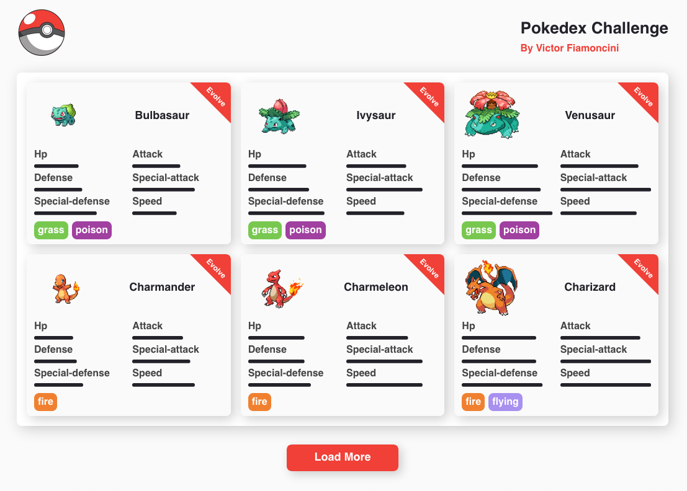

# Pokedex Victor Fiamoncini 

Repositório do desafio frontend - pokedex do cantidato Victor Fiamoncini.

## Como executar  🛠
Utilizando yarn (ambiente de desenvolvimento):

```bash
$ yarn
$ yarn start
```

Utilizando npm (ambiente de desenvolvimento):

```bash
$ npm i
$ npm run start
```

## Descrição/Processo de desenvolvimento

O modelo de desenvolvimento que escolhi segue um padrão que venho utilizando muito em meus projetos React, esse padrão seria em dividir as diferentes responsabilidades da aplicação em contextos, fazendo uso da ContextAPI nativa do React. Nesse projeto me deparei com dois contextos: o de esquema de cores da interface e o de pokemons, onde esses contextos possuem estados, métodos e tipos diferentes para fornecer determinada funcionalidade ao restante da aplicação. Meu maior desafio foi em determinar o fluxo de requisições para poder saber se o pokemon poderia evoluir, tive que fazer mais requisições do que eu pensava antes de ler a documentação da API.

## Amostra do projeto

**Link para acesso em produção (netlify):** [pokedex](https://victorfiamoncinipokedex.netlify.app)



## Principais bibliotecas utilizadas
- React
- Typescript
- Styled Components
- Axios
- Polished
- React Spinners
- React Toastify

----------
By [Victor B. Fiamoncini](https://github.com/Victor-Fiamoncini) ☕️
